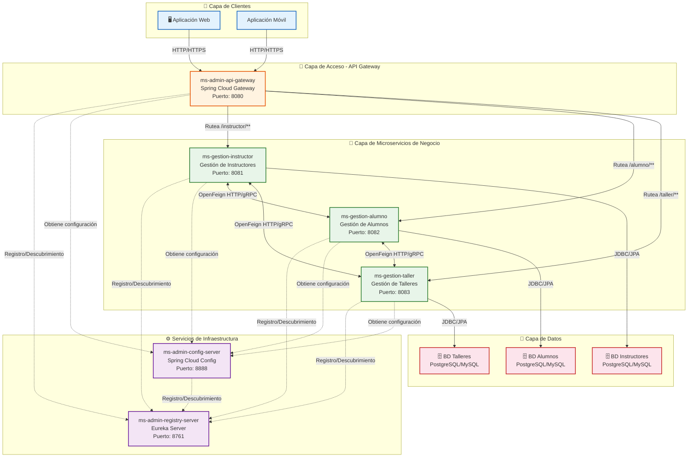
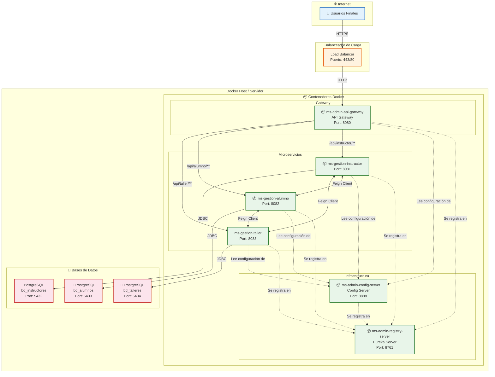
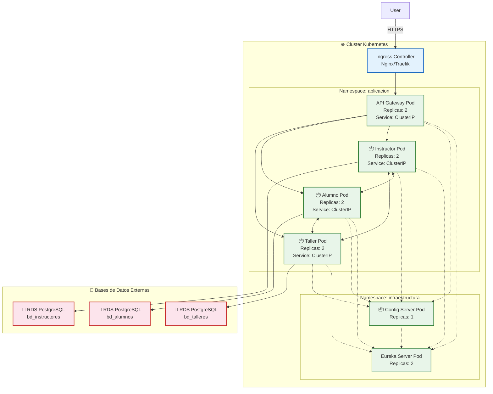

# Diagramas del Proyecto - Microservicios Spring Cloud

## 1. Diagrama de Arquitectura de Componentes

## 2. Diagrama de Despliegue

## 3. Diagrama de Despliegue en Kubernetes (Opcional - Producción)

## 4. Tabla de Puertos y Servicios

| Servicio | Puerto | Descripción |
|----------|--------|-------------|
| ms-admin-config-server | 8888 | Servidor de configuración centralizada |
| ms-admin-registry-server | 8761 | Servidor de registro Eureka |
| ms-admin-api-gateway | 8080 | Puerta de enlace API |
| ms-gestion-instructor | 8081 | Microservicio de gestión de instructores |
| ms-gestion-alumno | 8082 | Microservicio de gestión de alumnos |
| ms-gestion-taller | 8083 | Microservicio de gestión de talleres |
| PostgreSQL (Instructores) | 5432 | Base de datos de instructores |
| PostgreSQL (Alumnos) | 5433 | Base de datos de alumnos |
| PostgreSQL (Talleres) | 5434 | Base de datos de talleres |

## 5. Tecnologías Utilizadas

| Capa | Tecnología |
|------|------------|
| Framework | Spring Boot 3.x |
| Cloud | Spring Cloud 2023.x |
| Gateway | Spring Cloud Gateway |
| Registry | Netflix Eureka Server |
| Config | Spring Cloud Config Server |
| Comunicación | OpenFeign, HTTP/gRPC |
| Base de Datos | PostgreSQL / MySQL |
| ORM | Spring Data JPA / Hibernate |
| Contenedores | Docker |
| Orquestación | Kubernetes (opcional) |
| CI/CD | GitHub Actions / Jenkins |
